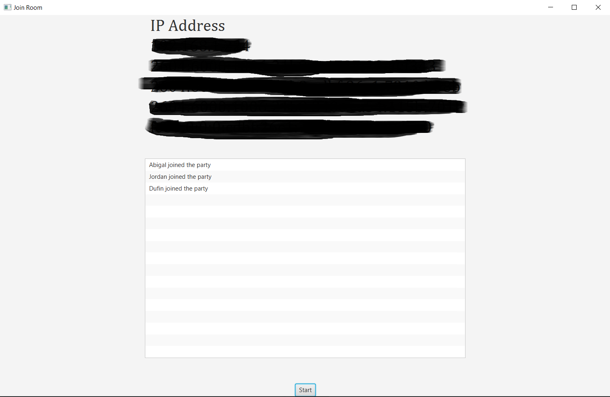
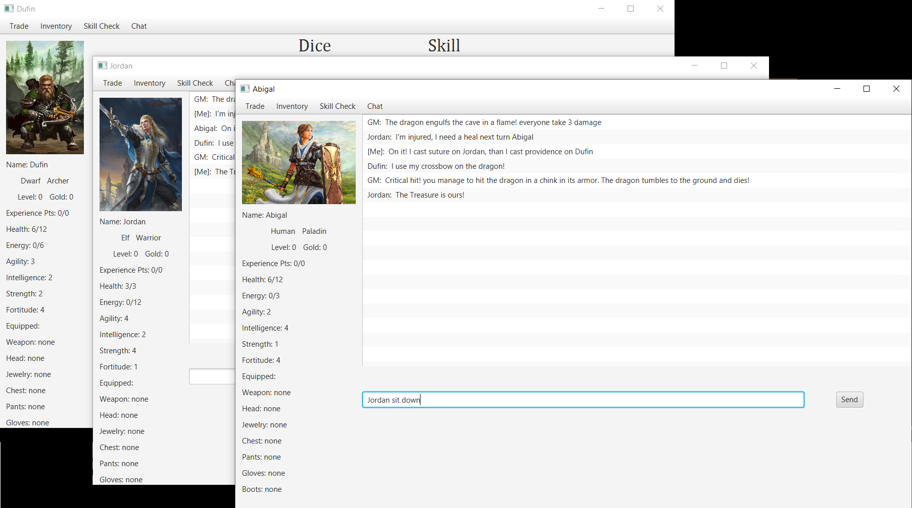

# PaperGame-GUI
Table Top Role Playing Game Interface

PaperGame is a new tabletop role playing game that can be played with your friends!
PaperGame gives user total creative freedom over the content of their adventures. At the same time PaperGame is a useful tool for every thing you need to do within the game.

PaperGame is multi-threaded, contains a P2P network, implements network protocols for quick object transfer, and a thread wrapper class to prevent issues in concurrent threads.

PaperGame is still in the development phase and needs alot more work before it will be a product others can enjoy easily.

